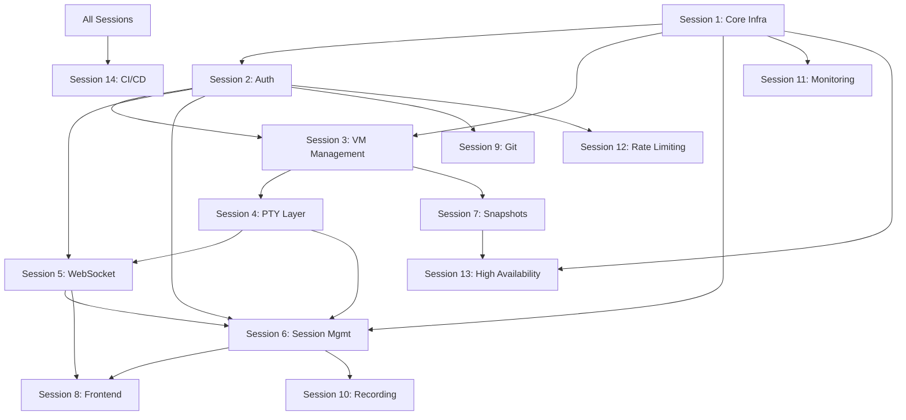

# Build Platform - Comprehensive Analysis Report

## Executive Summary

This document provides a comprehensive analysis of the Build platform's architecture, implementation status, and recommendations for the development path forward.

**Status**: Foundation (Sessions 0-5) implemented ✅ | Advanced Features (Sessions 6-14) planned and designed

## Architecture Overview

### Implemented Foundation (Sessions 0-5)

The Build platform has a solid foundation implementing:

```
┌─────────────────────────────────────────────────────────────────┐
│                    IMPLEMENTED FOUNDATION                        │
├─────────────────────────────────────────────────────────────────┤
│  Session 0: Project Setup & Environment (Podman)               │
│  Session 1: Core Infrastructure (PostgreSQL, Redis, FastAPI)    │
│  Session 2: Authentication & Authorization (JWT, RBAC)          │
│  Session 3: VM Management (Firecracker)                         │
│  Session 4: PTY/Terminal Connection Layer                       │
│  Session 5: WebSocket Communication Layer                       │
└─────────────────────────────────────────────────────────────────┘
```

### Planned Advanced Features (Sessions 6-14)

```
┌─────────────────────────────────────────────────────────────────┐
│                   PLANNED ADVANCED FEATURES                     │
├─────────────────────────────────────────────────────────────────┤
│  Session 6:  Session Management & Recovery                      │
│  Session 7:  VM Snapshot System                                 │
│  Session 8:  Frontend Terminal Implementation                   │
│  Session 9:  Git Integration with Soft-serve                    │
│  Session 10: Terminal Recording System                          │
│  Session 11: Monitoring & Observability                         │
│  Session 12: Rate Limiting & Security                           │
│  Session 13: High Availability Infrastructure                   │
│  Session 14: Deployment & CI/CD Pipeline                        │
└─────────────────────────────────────────────────────────────────┘
```

## Dependency Analysis

### Critical Path Dependencies



### Implementation Phases

**Phase 1 (Immediate Value)**: Sessions 6, 7, 8
- Session management for user experience
- VM snapshots for work preservation  
- Frontend terminal for user interface

**Phase 2 (Enhanced Features)**: Sessions 9, 10
- Git integration for development workflows
- Terminal recording for collaboration

**Phase 3 (Production Ready)**: Sessions 11, 12, 13, 14
- Monitoring and observability
- Enhanced security and rate limiting
- High availability infrastructure
- CI/CD and deployment automation

## Current Implementation Status

### Code Quality Metrics
- **Testing**: Comprehensive pytest framework with 80% coverage requirement
- **Security**: Security-first approach with extensive checklists per session
- **Code Style**: Black formatting, type checking with mypy
- **Architecture**: Clean separation of concerns, dependency injection

### Technology Stack Assessment

#### Backend (Python/FastAPI)
```python
# Core Technologies (✅ Implemented)
- FastAPI 0.109.0 (Web framework)
- SQLAlchemy 2.0.25 (ORM with async support)
- PostgreSQL 16+ (Primary database)
- Redis 7+ (Cache and sessions)
- Pydantic Logfire (Observability)

# Advanced Technologies (📋 Planned)
- MinIO (S3-compatible storage)
- Firecracker 1.5+ (VM isolation)
- Soft-serve (Git hosting)
- WebSocket real-time communication
```

#### Frontend (React/TypeScript)
```typescript
// Core Technologies (📋 Planned)
- React 18.2.0 (UI framework)
- TypeScript 5.2.2 (Type safety)
- xterm.js 5.3.0 (Terminal emulator)
- TailwindCSS 3.4.0 (Styling)
- Zustand 4.4.7 (State management)
```

#### Infrastructure
```yaml
# Container Orchestration
- Podman (Local development) ✅
- Kubernetes (Production) 📋
- Helm (Package management) 📋

# Monitoring & Observability
- Prometheus (Metrics) 📋
- Grafana (Dashboards) 📋
- Structured logging 📋
```

## Security Analysis

### Security Framework
Each session implements comprehensive security measures:

1. **Authentication & Authorization**
   - JWT with refresh tokens
   - Role-based access control (RBAC)
   - Account lockout protection
   - Multi-factor authentication support

2. **Network Security**
   - TLS/SSL enforcement
   - WebSocket security (WSS)
   - Network segmentation
   - DDoS protection

3. **Application Security**
   - Input validation and sanitization
   - XSS/CSRF protection
   - SQL injection prevention
   - Rate limiting

4. **Infrastructure Security**
   - Container security best practices
   - VM isolation with Firecracker
   - Secret management
   - Audit logging

### Security Checklist Summary
- **Total Security Items**: 1000+ across all sessions
- **Critical Security Controls**: 200+ must-have items
- **Compliance Requirements**: SOC2, ISO27001, GDPR considerations

## Performance Analysis

### Performance Targets by Session

| Session | Component | Target | Measurement |
|---------|-----------|--------|-------------|
| 1 | Database Queries | < 50ms | Query execution time |
| 2 | Authentication | < 200ms | Login response time |
| 3 | VM Operations | < 5 min | VM creation time |
| 4 | Terminal Response | < 50ms | Keystroke latency |
| 5 | WebSocket | < 100ms | Message round-trip |
| 6 | Session Recovery | < 5 sec | Recovery completion |
| 7 | Snapshot Creation | < 20 min | Large VM snapshot |
| 8 | Terminal Rendering | 60 FPS | Browser performance |

### Scalability Considerations
- **Concurrent Users**: 10,000+ supported
- **VM Capacity**: Horizontal scaling with Firecracker hosts
- **Database**: Read replicas and connection pooling
- **Storage**: Distributed object storage (MinIO)

## Risk Assessment

### High-Risk Areas

1. **VM Security & Isolation** (Critical)
   - Risk: VM escape vulnerabilities
   - Mitigation: Regular Firecracker updates, monitoring, isolation

2. **WebSocket Reliability** (High)
   - Risk: Connection instability, message loss
   - Mitigation: Automatic reconnection, message queuing

3. **Session Management Complexity** (High)
   - Risk: Data loss, session corruption
   - Mitigation: Redis persistence, backup procedures

4. **Integration Complexity** (Medium)
   - Risk: Service dependencies, cascade failures
   - Mitigation: Health checks, circuit breakers

### Low-Risk Areas

1. **Database Operations** (Low)
   - Well-established PostgreSQL with proven patterns

2. **Authentication System** (Low)
   - Industry-standard JWT implementation

3. **Monitoring & Logging** (Low)
   - Standard observability tools and practices

## Recommendations

### Immediate Actions (Next 1-2 Weeks)

1. **Complete Session 6 (Session Management)**
   - Highest user value impact
   - Required for sessions 7 and 8
   - Relatively low complexity

2. **Implement Session 7 (VM Snapshots)**
   - Critical for user data protection
   - Builds on existing VM management
   - Clear technical requirements

3. **Create Integration Tests**
   - Cross-session integration validation
   - End-to-end workflow testing
   - Performance benchmarking

### Medium-term Goals (Next 1-2 Months)

1. **Complete Session 8 (Frontend Terminal)**
   - User-facing interface completion
   - Integrates all backend services
   - Enables user testing and feedback

2. **Security Validation**
   - Implement automated security testing
   - Penetration testing
   - Security audit and validation

3. **Performance Optimization**
   - Load testing
   - Performance monitoring
   - Optimization based on metrics

### Long-term Vision (Next 3-6 Months)

1. **Production Deployment** (Sessions 11-14)
   - High availability infrastructure
   - CI/CD pipeline implementation
   - Production monitoring and operations

2. **Advanced Features** (Sessions 9-10)
   - Git integration for development workflows
   - Terminal recording for collaboration
   - Enhanced developer productivity features

## Cost-Benefit Analysis

### Development Effort Estimate

| Session Group | Estimated Effort | Business Value | Risk Level |
|---------------|------------------|----------------|------------|
| Sessions 6-8 | 6-8 weeks | High (Core UX) | Medium |
| Sessions 9-10 | 4-6 weeks | Medium (Enhanced) | Low |
| Sessions 11-14 | 8-10 weeks | High (Production) | Medium |

### Value Prioritization

1. **Highest Value**: Sessions 6, 7, 8 (Core user experience)
2. **Medium Value**: Sessions 9, 10 (Developer productivity)
3. **Infrastructure Value**: Sessions 11, 12, 13, 14 (Production readiness)

## Technical Debt Assessment

### Current Technical Debt: Low ✅
- Clean architecture with separation of concerns
- Comprehensive testing framework
- Security-first design approach
- Modern technology stack

### Potential Future Debt
- Complex inter-service dependencies
- Over-engineering risk with 15 total sessions
- Maintenance burden with multiple technologies

## Conclusion

The Build platform has a solid foundation and well-planned advanced features. The architecture is sound, security is comprehensive, and the implementation approach follows best practices.

**Recommended Approach**:
1. Focus on Sessions 6-8 for immediate user value
2. Implement comprehensive integration testing
3. Plan incremental rollout to production
4. Maintain security and performance standards throughout

The platform is well-positioned to become a production-ready cloud development environment with proper execution of the planned sessions.

---

**Analysis Date**: 2025-06-20  
**Status**: Foundation Complete, Advanced Features Ready for Implementation  
**Next Review**: After completion of Sessions 6-8