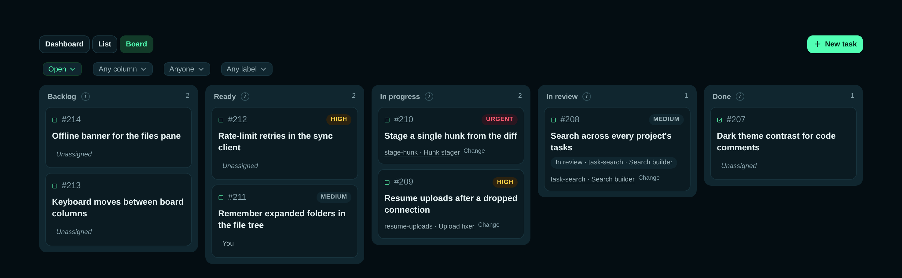

# Build

**Your agents. Your machine. Your call.**

You set a goal from any device. An agent on *your* hardware builds it on its
own branch; you review the diff, comment and send it back, and when it is right
you merge.



> **Status: invite-only alpha.** Join the waitlist at
> [getbuild.ing](https://getbuild.ing). What works today: the bridge on macOS
> and Linux (Intel and ARM), the web client and the desktop app, several paired
> machines at once, Claude Code, Codex CLI and Pi agents, and git worktree or
> Rift copy-on-write isolation. What does not yet: a native Windows bridge,
> OpenCode, self-updates for a bridge you built yourself, and any machine that
> cannot be reached directly or through TURN (it is shown as blocked; there is
> no relayed fallback).

Contributing? Start at [CONTRIBUTING.md](CONTRIBUTING.md).

## Install

```sh
# Bridge: installs the daemon, pairs it, and enables its background service
curl -fsSL https://getbuild.ing/install.sh | sh

# Desktop app: installs the app for the current user
curl -fsSL https://getbuild.ing/install-desktop.sh | sh
```

Public installers detect macOS or Linux and select the Intel/x86_64 or ARM64
release. No website login or download token is required. The bridge goes in
`~/.local/bin`. The desktop app goes in `~/Applications/Build.app` on macOS, or
`~/.local/share/build-desktop` on Linux, with a launcher in `~/.local/bin` and
an application-menu entry. Run the desktop installer again to update.
Application sign-in and bridge pairing still use your Build account.

Both installers verify SHA-256 checksums and verify the release's Sigstore
signature when `cosign` is installed. Downloads come from the public
[`build-releases`](https://github.com/ZechCodes/build-releases/releases)
repository. The bridge follows its latest release; the desktop installer
resolves the `desktop-latest` version pointer and then downloads that specific
desktop release. This keeps the two products' versions independent.

To select a version, set `BUILD_BRIDGE_VERSION` or `BUILD_DESKTOP_VERSION` on
the shell receiving the script, for example:

```sh
curl -fsSL https://getbuild.ing/install-desktop.sh | BUILD_DESKTOP_VERSION=0.1.0 sh
```

### Pairing

The bridge installer runs `build-bridge pair`, which prints a pairing code, the
first 32 hex digits of the device's key fingerprint, and an `approve at:` link.
The link opens Build's **Add a device** screen with this device already looked
up, after sign-in if you are signed out. Check that the fingerprint matches,
then press **Approve & pair**. Approve only a device you just ran the installer
or `build-bridge pair` on: approving gives that machine access to your account,
and anyone can send you a pairing link. You can also type the code into **Settings → Devices → Add
a device**.

If this machine's stored pairing was revoked, or the api no longer knows it,
`pair` sets the old identity aside in `~/.build` as
`identity.json.retired-<device id>` and pairs it as a new device. When that
was a mistake, such as a wrong `BRIDGE_API_URL`, stop the run and move the
file back:

```sh
mv ~/.build/identity.json.retired-<device id> ~/.build/identity.json
```

To build either one from source, see
[Build locally](CONTRIBUTING.md#build-locally).

## Supported agents

**Claude Code**, **Codex CLI** and **Pi**, chosen for each agent you start,
with each provider's model and reasoning-effort options; the CLI must already
be installed and signed in on the machine running `build-bridge`.

## How it works

Build does not run agents, host code, or see code. Agents run on your own
machine via the bridge. Build's job is **orchestration**: starting work,
watching it through git, and gating the transitions where human judgment
matters. Think of it as tmux for coding agents, in your browser and end-to-end
encrypted. You talk to agents in their threads from the compose box, review
their diffs with batched comments, merge from the same screen, and can drop
into an agent's terminal at any point, though you never have to.

```
                    getbuild.ing                relay.getbuild.ing
┌─────────┐  HTTPS ┌────────────┐  /internal/*  ┌────────────┐  wss ┌─────────┐
│ browser │◄──────►│ skriftapp  │◄──────────────│ Rust relay │◄────►│ bridge  │
│  (SPA)  │        │ api + SPA  │               │ rendezvous │      │ (user's │
└──┬─┬────┘        └─────┬──────┘               │    only    │      │  box)   │
   │ │                   ▼                      └────────────┘      └────┬────┘
   │ │             Postgres 16                        ▲                  │
   │ └────── wss /ws/client (while negotiating) ──────┘                  │
   └╌╌╌╌╌╌ WebRTC DataChannels (direct; Cloudflare TURN fallback) ╌╌╌╌╌╌╌┘
```

Build hosts **authentication and rendezvous, and nothing else.** Conversations,
commits, diffs and files are large, and relaying any meaningful share of them is
the cost a hosted service must not carry. So the relay finds your machine and
carries the WebRTC negotiation; the browser closes that socket once the
DataChannels are open, and every application byte goes peer to peer from then
on. A machine that cannot be reached directly (or through TURN) is shown as
blocked, with the reason and a Retry. There is nothing underneath to fall back
to.

| Component | Where | What |
|---|---|---|
| `bridge/` | user machines | Rust device daemon: worktree-per-task, full-PTY harnesses, Build's MCP tools for agents, git-diff watcher, durable task store, E2EE transport, device pairing |
| `bridge/src/bin/relay.rs` | relay.getbuild.ing | Rust ciphertext-only broker: `/ws/device` (Ed25519 auth) + `/ws/client` (gateway-token auth). Carries session setup and `rtc.*` signaling and refuses everything else; presence and transport keys are the api's |
| `skriftapp/` | getbuild.ing | Python app server (Skrift): passkey auth, device registry/approval, gateway tokens, web push, the admin transport page (how sessions reach bridges: direct / TURN / relay), serves the SPA |
| `spa/` | built into skriftapp | Vite vanilla-ES-module web client: task board, agent threads, diff review, terminal drawer; all deps self-hosted, zero CDN |
| `desktop/` | user desktops | Sandboxed Electron client for the hosted SPA; connects to a separately installed bridge the same way the browser does |
| `web/` | dev only | Node E2EE test/QA harnesses |
| `deploy/` | | podman compose stack + k8s manifests and the cutover runbook |

The E2EE crypto layer lives in the separate
[`build-secure-transport`](https://github.com/ZechCodes/build-secure-transport)
repo (Python + JS bindings; the bridge carries an interop-verified Rust port),
published under its own licence (see its
[LICENSE.md](https://github.com/ZechCodes/build-secure-transport/blob/main/LICENSE.md)).

**A second infrastructure party.** Browser and bridge negotiate direct WebRTC DataChannels and
use Cloudflare TURN only when neither peer can hole-punch, which makes Cloudflare a second
infrastructure party beside the relay. Cloudflare sees TURN allocation source IPs and DTLS
ciphertext; under that DTLS is the same secretbox envelope the relay carries during negotiation,
so even a broken DTLS session exposes no more than the relay already saw (session ids, sizes,
timing) and never plaintext or session keys. The peer's DTLS fingerprint travels inside the sealed session,
so neither Cloudflare nor anyone else on the path can substitute a peer. The direct path adds
the one exposure the relay path hid: each peer learns the other's IP. TURN credentials are
short-lived (their lifetime is `TTL_SECONDS` in `skriftapp/buildapp/ice_servers.py`), minted
per authenticated user by the api, and reach the bridge inside the sealed session; the TURN key
itself never leaves the api Secret.

How each piece is built inside (the bridge's RPC and push model, its state,
stores, harnesses and MCP tools; the web client's cache, connection state
machine and surfaces) is in [`ARCHITECTURE.md`](ARCHITECTURE.md).

## More

- [Using Build](docs/using.md): devices, device project folders, projects and
  workspaces, work isolation (git worktrees or Rift).
- [Contributing](CONTRIBUTING.md): getting started, building locally, testing,
  and the working rules.
- [Releasing the desktop app](docs/releasing.md), and the bridge's release
  procedure in [`deploy/README.md`](deploy/README.md), which also covers
  running the whole stack. Production deploy:
  [`deploy/k8s/CUTOVER.md`](deploy/k8s/CUTOVER.md).
- [Changelog](CHANGELOG.md).
- [`planning/v2/`](planning/v2/): the full scope, UI design brief and roadmap.
- Brand assets: official SVG and PNG artwork (the transparent mark and
  black-on-mint, mint-on-black and black-on-white variants), and how to
  regenerate the website, SPA and desktop icons from it, are in
  [`assets/brand/`](assets/brand/README.md).

## License

Copyright (C) 2026 Zech Zimmerman

Build is licensed under the [GNU Affero General Public License v3.0
only](LICENSE) (`AGPL-3.0-only`). You are free to use, modify and self-host it.
If you run a modified version as a network service, you must offer its source
to the service's users under the same license. Commercial licensing is
available from the maintainer. The E2EE transport is published separately for
auditability, under its own license (see its
[LICENSE.md](https://github.com/ZechCodes/build-secure-transport/blob/main/LICENSE.md)).
Contributions are accepted under the AGPL and a signed
[Contributor License Agreement](CLA.md), as described in
[CONTRIBUTING.md](CONTRIBUTING.md).
