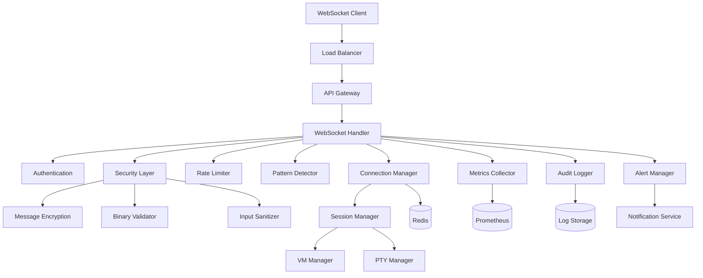

# WebSocket Integration Guide

## Overview

This guide provides comprehensive instructions for integrating and deploying the Build Platform WebSocket Communication Layer. It covers architecture, component integration, deployment, monitoring, and operational procedures.

## Table of Contents

1. [Architecture Overview](#architecture-overview)
2. [Component Integration](#component-integration)
3. [Deployment Guide](#deployment-guide)
4. [Configuration Management](#configuration-management)
5. [Security Integration](#security-integration)
6. [Monitoring Setup](#monitoring-setup)
7. [Operational Procedures](#operational-procedures)
8. [Troubleshooting](#troubleshooting)
9. [Performance Tuning](#performance-tuning)
10. [Migration Guide](#migration-guide)

## Architecture Overview

### System Components



### Data Flow

1. **Connection Establishment**
   - Client connects → Load balancer → API Gateway
   - TLS termination and certificate validation
   - WebSocket upgrade and protocol negotiation
   - Authentication and authorization

2. **Message Processing**
   - Message receipt → Decryption → Pattern detection
   - Security validation → Rate limiting check
   - Business logic processing → Response generation
   - Audit logging → Metrics collection

3. **Session Management**
   - Session creation → VM allocation → PTY initialization
   - Terminal I/O handling → Output streaming
   - Session state persistence → Recovery handling

## Component Integration

### 1. Authentication Integration

```python
# app/websocket/auth.py integration
from app.security.jwt import JWTManager
from app.core.config import get_settings

def setup_websocket_auth():
    settings = get_settings()
    jwt_manager = JWTManager(secret_key=settings.jwt_secret)
    authenticator = WebSocketAuthenticator(jwt_manager)
    return authenticator
```

### 2. Database Integration

```python
# app/websocket/connections.py integration
from app.database import get_db_session
from app.models.user import User
from app.models.session import TerminalSession

async def bind_session_to_db(session_id: str, user_id: str):
    async with get_db_session() as db:
        session = TerminalSession(
            id=session_id,
            user_id=user_id,
            status="active",
            created_at=datetime.utcnow()
        )
        db.add(session)
        await db.commit()
```

### 3. Redis Integration

```python
# Redis configuration for connection state storage
REDIS_CONFIG = {
    "host": "redis.build.internal",
    "port": 6379,
    "password": os.getenv("REDIS_PASSWORD"),
    "ssl": True,
    "ssl_cert_reqs": "required",
    "ssl_ca_certs": "/etc/ssl/certs/redis-ca.pem",
    "decode_responses": False,  # Keep binary for encryption
    "socket_timeout": 5,
    "socket_connect_timeout": 5,
    "retry_on_timeout": True,
    "health_check_interval": 30
}
```

### 4. VM Manager Integration

```python
# app/websocket/vm_integration.py
from app.vm.firecracker_service import FirecrackerService
from app.vm.vm_manager_integration import VMManagerIntegration

class WebSocketVMIntegration:
    def __init__(self):
        self.firecracker = FirecrackerService()
        self.vm_manager = VMManagerIntegration()
    
    async def create_terminal_session(self, vm_id: str, user_id: str):
        # Ensure VM is running
        vm_status = await self.vm_manager.get_vm_status(vm_id)
        if vm_status != "running":
            await self.vm_manager.start_vm(vm_id)
        
        # Create PTY session in VM
        session_id = await self.firecracker.create_pty_session(vm_id)
        return session_id
```

### 5. Monitoring Integration

```python
# app/websocket/monitoring_integration.py
from prometheus_client import Counter, Histogram, Gauge
import structlog

# Prometheus metrics
WEBSOCKET_CONNECTIONS = Gauge('websocket_connections_total', 'Active WebSocket connections')
WEBSOCKET_MESSAGES = Counter('websocket_messages_total', 'Total WebSocket messages', ['type', 'status'])
WEBSOCKET_LATENCY = Histogram('websocket_message_duration_seconds', 'Message processing latency')

# Structured logging setup
structlog.configure(
    processors=[
        structlog.processors.TimeStamper(fmt="iso"),
        structlog.processors.add_log_level,
        structlog.processors.JSONRenderer()
    ],
    logger_factory=structlog.WriteLoggerFactory(),
    wrapper_class=structlog.BoundLogger,
    cache_logger_on_first_use=True,
)
```

## Deployment Guide

### 1. Infrastructure Requirements

```yaml
# infrastructure/websocket/requirements.yml
minimum_requirements:
  cpu: "4 cores"
  memory: "8GB"
  network: "1Gbps"
  storage: "100GB SSD"

recommended_production:
  cpu: "16 cores"
  memory: "32GB"
  network: "10Gbps"
  storage: "500GB NVMe"

dependencies:
  - Redis Cluster (3+ nodes)
  - PostgreSQL (Primary + Replica)
  - Load Balancer (HAProxy/NGINX)
  - Certificate Authority
  - Monitoring Stack (Prometheus/Grafana)
```

### 2. Kubernetes Deployment

```yaml
# k8s/websocket-deployment.yml
apiVersion: apps/v1
kind: Deployment
metadata:
  name: websocket-api
  namespace: build-platform
spec:
  replicas: 3
  selector:
    matchLabels:
      app: websocket-api
  template:
    metadata:
      labels:
        app: websocket-api
    spec:
      containers:
      - name: websocket-api
        image: 8ly/build-websocket:v1.2.0
        ports:
        - containerPort: 8000
        env:
        - name: REDIS_URL
          valueFrom:
            secretKeyRef:
              name: redis-credentials
              key: url
        - name: DATABASE_URL
          valueFrom:
            secretKeyRef:
              name: postgres-credentials
              key: url
        - name: JWT_SECRET
          valueFrom:
            secretKeyRef:
              name: jwt-secret
              key: secret
        resources:
          requests:
            cpu: "500m"
            memory: "1Gi"
          limits:
            cpu: "2000m"
            memory: "4Gi"
        livenessProbe:
          httpGet:
            path: /health
            port: 8000
          initialDelaySeconds: 30
          periodSeconds: 10
        readinessProbe:
          httpGet:
            path: /ready
            port: 8000
          initialDelaySeconds: 5
          periodSeconds: 5
        volumeMounts:
        - name: audit-logs
          mountPath: /var/log/audit
        - name: certificates
          mountPath: /etc/ssl/certs
      volumes:
      - name: audit-logs
        persistentVolumeClaim:
          claimName: audit-logs-pvc
      - name: certificates
        secret:
          secretName: ssl-certificates
```

### 3. Service Configuration

```yaml
# k8s/websocket-service.yml
apiVersion: v1
kind: Service
metadata:
  name: websocket-service
  namespace: build-platform
spec:
  selector:
    app: websocket-api
  ports:
  - name: http
    port: 80
    targetPort: 8000
  - name: websocket
    port: 8080
    targetPort: 8000
  type: LoadBalancer
  sessionAffinity: ClientIP
  sessionAffinityConfig:
    clientIP:
      timeoutSeconds: 3600
```

### 4. Ingress Configuration

```yaml
# k8s/websocket-ingress.yml
apiVersion: networking.k8s.io/v1
kind: Ingress
metadata:
  name: websocket-ingress
  namespace: build-platform
  annotations:
    nginx.ingress.kubernetes.io/proxy-read-timeout: "3600"
    nginx.ingress.kubernetes.io/proxy-send-timeout: "3600"
    nginx.ingress.kubernetes.io/websocket-services: "websocket-service"
    nginx.ingress.kubernetes.io/ssl-redirect: "true"
    cert-manager.io/cluster-issuer: "letsencrypt-prod"
spec:
  tls:
  - hosts:
    - api.build.8ly.com
    secretName: websocket-tls
  rules:
  - host: api.build.8ly.com
    http:
      paths:
      - path: /ws
        pathType: Prefix
        backend:
          service:
            name: websocket-service
            port:
              number: 8080
```

## Configuration Management

### 1. Environment Configuration

```python
# app/core/websocket_config.py
from pydantic import BaseSettings, Field
from typing import List, Optional

class WebSocketSettings(BaseSettings):
    # Connection settings
    max_connections_per_user: int = Field(5, env="WS_MAX_CONNECTIONS_PER_USER")
    max_connections_per_session: int = Field(3, env="WS_MAX_CONNECTIONS_PER_SESSION")
    heartbeat_interval: int = Field(30, env="WS_HEARTBEAT_INTERVAL")
    connection_timeout: int = Field(300, env="WS_CONNECTION_TIMEOUT")
    
    # Security settings
    enable_pattern_detection: bool = Field(True, env="WS_ENABLE_PATTERN_DETECTION")
    pattern_detection_threshold: float = Field(0.5, env="WS_PATTERN_THRESHOLD")
    enable_audit_logging: bool = Field(True, env="WS_ENABLE_AUDIT_LOGGING")
    audit_log_path: str = Field("/var/log/audit/websocket.log", env="WS_AUDIT_LOG_PATH")
    
    # Rate limiting
    rate_limit_per_second: int = Field(100, env="WS_RATE_LIMIT_PER_SECOND")
    rate_limit_burst: int = Field(50, env="WS_RATE_LIMIT_BURST")
    rate_limit_window: int = Field(60, env="WS_RATE_LIMIT_WINDOW")
    
    # Performance settings
    enable_compression: bool = Field(True, env="WS_ENABLE_COMPRESSION")
    compression_threshold: int = Field(200, env="WS_COMPRESSION_THRESHOLD")
    enable_acknowledgments: bool = Field(True, env="WS_ENABLE_ACKNOWLEDGMENTS")
    ack_timeout: int = Field(30, env="WS_ACK_TIMEOUT")
    
    # Redis settings
    redis_url: str = Field(..., env="REDIS_URL")
    redis_key_prefix: str = Field("ws:", env="WS_REDIS_PREFIX")
    redis_connection_pool_size: int = Field(20, env="WS_REDIS_POOL_SIZE")
    
    # Monitoring
    metrics_enabled: bool = Field(True, env="WS_METRICS_ENABLED")
    metrics_port: int = Field(9090, env="WS_METRICS_PORT")
    health_check_interval: int = Field(60, env="WS_HEALTH_CHECK_INTERVAL")
    
    class Config:
        env_file = ".env"
        case_sensitive = False
```

### 2. Security Configuration

```python
# app/core/security_config.py
SECURITY_CONFIG = {
    "allowed_origins": [
        "https://app.8ly.com",
        "https://staging.8ly.com",
        "https://dev.8ly.com"
    ],
    "certificate_pinning": {
        "enabled": True,
        "pins": [
            "sha256:AAAAAAAAAAAAAAAAAAAAAAAAAAAAAAAAAAAAAAAAAAA=",
            "sha256:BBBBBBBBBBBBBBBBBBBBBBBBBBBBBBBBBBBBBBBBBBB="
        ]
    },
    "pattern_detection": {
        "enabled": True,
        "confidence_threshold": 0.5,
        "false_positive_threshold": 0.7,
        "categories": [
            "command_injection",
            "xss_attack", 
            "path_traversal",
            "sql_injection",
            "malware_signature"
        ]
    },
    "rate_limiting": {
        "anonymous": {"rate": 10, "burst": 5},
        "authenticated": {"rate": 100, "burst": 50},
        "premium": {"rate": 200, "burst": 100}
    }
}
```

## Security Integration

### 1. Authentication Setup

```python
# scripts/setup_auth.py
import asyncio
from app.security.jwt import JWTManager
from app.websocket.auth import WebSocketAuthenticator

async def setup_websocket_authentication():
    # Initialize JWT manager
    jwt_manager = JWTManager(
        secret_key=settings.jwt_secret,
        algorithm="HS256",
        access_token_expire_minutes=15,
        refresh_token_expire_days=7
    )
    
    # Setup WebSocket authenticator
    authenticator = WebSocketAuthenticator(jwt_manager)
    
    # Test authentication
    test_token = jwt_manager.create_access_token({"sub": "test_user"})
    is_valid = await authenticator.validate_token(test_token)
    
    print(f"Authentication setup: {'✓' if is_valid else '✗'}")
    return authenticator
```

### 2. TLS/SSL Configuration

```nginx
# nginx/websocket.conf
upstream websocket_backend {
    server websocket-api-1:8000;
    server websocket-api-2:8000;
    server websocket-api-3:8000;
}

server {
    listen 443 ssl http2;
    server_name api.build.8ly.com;
    
    ssl_certificate /etc/ssl/certs/api.build.8ly.com.pem;
    ssl_certificate_key /etc/ssl/private/api.build.8ly.com.key;
    
    ssl_protocols TLSv1.2 TLSv1.3;
    ssl_ciphers ECDHE-RSA-AES256-GCM-SHA512:DHE-RSA-AES256-GCM-SHA512;
    ssl_prefer_server_ciphers off;
    ssl_session_cache shared:SSL:10m;
    ssl_session_timeout 10m;
    
    # HSTS
    add_header Strict-Transport-Security "max-age=63072000" always;
    
    # WebSocket location
    location /ws/ {
        proxy_pass http://websocket_backend;
        proxy_http_version 1.1;
        proxy_set_header Upgrade $http_upgrade;
        proxy_set_header Connection "upgrade";
        proxy_set_header Host $host;
        proxy_set_header X-Real-IP $remote_addr;
        proxy_set_header X-Forwarded-For $proxy_add_x_forwarded_for;
        proxy_set_header X-Forwarded-Proto $scheme;
        
        proxy_read_timeout 3600s;
        proxy_send_timeout 3600s;
        
        # Security headers
        proxy_set_header Origin $http_origin;
        proxy_set_header Sec-WebSocket-Protocol $http_sec_websocket_protocol;
    }
}
```

### 3. Firewall Rules

```bash
#!/bin/bash
# scripts/setup_firewall.sh

# Allow WebSocket traffic
ufw allow 8000/tcp comment "WebSocket API"
ufw allow 8080/tcp comment "WebSocket connections"

# Allow monitoring
ufw allow 9090/tcp comment "Metrics endpoint"

# Allow Redis (internal only)
ufw allow from 10.0.0.0/8 to any port 6379 comment "Redis internal"

# Allow PostgreSQL (internal only)
ufw allow from 10.0.0.0/8 to any port 5432 comment "PostgreSQL internal"

# Block known malicious IPs
ufw deny from 192.168.1.100 comment "Blocked malicious IP"

# Rate limiting at firewall level
iptables -A INPUT -p tcp --dport 8000 -m limit --limit 25/minute --limit-burst 100 -j ACCEPT
```

## Monitoring Setup

### 1. Prometheus Configuration

```yaml
# monitoring/prometheus.yml
global:
  scrape_interval: 15s
  evaluation_interval: 15s

rule_files:
  - "websocket_rules.yml"

scrape_configs:
  - job_name: 'websocket-api'
    static_configs:
      - targets: ['websocket-api-1:9090', 'websocket-api-2:9090', 'websocket-api-3:9090']
    scrape_interval: 5s
    metrics_path: /metrics
    
  - job_name: 'websocket-health'
    static_configs:
      - targets: ['websocket-api-1:8000', 'websocket-api-2:8000', 'websocket-api-3:8000']
    scrape_interval: 30s
    metrics_path: /health/metrics

alerting:
  alertmanagers:
    - static_configs:
        - targets: ['alertmanager:9093']
```

### 2. Grafana Dashboard

```json
{
  "dashboard": {
    "title": "WebSocket API Monitoring",
    "panels": [
      {
        "title": "Active Connections",
        "type": "stat",
        "targets": [
          {
            "expr": "sum(websocket_connections_total)",
            "legendFormat": "Total Connections"
          }
        ]
      },
      {
        "title": "Message Throughput",
        "type": "graph",
        "targets": [
          {
            "expr": "rate(websocket_messages_total[5m])",
            "legendFormat": "Messages/sec"
          }
        ]
      },
      {
        "title": "Security Threats",
        "type": "graph",
        "targets": [
          {
            "expr": "rate(websocket_security_violations_total[5m])",
            "legendFormat": "Threats/sec"
          }
        ]
      },
      {
        "title": "Response Time",
        "type": "graph",
        "targets": [
          {
            "expr": "histogram_quantile(0.95, rate(websocket_message_duration_seconds_bucket[5m]))",
            "legendFormat": "95th percentile"
          }
        ]
      }
    ]
  }
}
```

### 3. Alert Rules

```yaml
# monitoring/websocket_rules.yml
groups:
  - name: websocket_alerts
    rules:
      - alert: WebSocketHighConnections
        expr: websocket_connections_total > 1000
        for: 5m
        labels:
          severity: warning
        annotations:
          summary: "High WebSocket connection count"
          description: "{{ $value }} active connections"
      
      - alert: WebSocketHighThreatRate
        expr: rate(websocket_security_violations_total[5m]) > 0.1
        for: 1m
        labels:
          severity: critical
        annotations:
          summary: "High security threat rate detected"
          description: "{{ $value }} threats per second"
      
      - alert: WebSocketHighLatency
        expr: histogram_quantile(0.95, rate(websocket_message_duration_seconds_bucket[5m])) > 1
        for: 2m
        labels:
          severity: warning
        annotations:
          summary: "High WebSocket latency"
          description: "95th percentile latency: {{ $value }}s"
```

## Operational Procedures

### 1. Deployment Checklist

```bash
#!/bin/bash
# scripts/deploy_checklist.sh

echo "🚀 WebSocket Deployment Checklist"

# Pre-deployment checks
echo "📋 Pre-deployment checks..."
kubectl get nodes | grep Ready || exit 1
kubectl get pvc | grep audit-logs-pvc || exit 1
kubectl get secret | grep redis-credentials || exit 1

# Deploy application
echo "🔄 Deploying application..."
kubectl apply -f k8s/websocket-deployment.yml
kubectl apply -f k8s/websocket-service.yml
kubectl apply -f k8s/websocket-ingress.yml

# Wait for rollout
echo "⏳ Waiting for rollout..."
kubectl rollout status deployment/websocket-api -n build-platform

# Health checks
echo "🏥 Running health checks..."
for i in {1..30}; do
    if kubectl get pods -n build-platform | grep websocket-api | grep Running; then
        echo "✓ Pods are running"
        break
    fi
    sleep 10
done

# Smoke tests
echo "💨 Running smoke tests..."
python scripts/smoke_tests.py || exit 1

echo "✅ Deployment complete!"
```

### 2. Health Monitoring

```python
# scripts/health_monitor.py
import asyncio
import aiohttp
import time
from typing import Dict, Any

class HealthMonitor:
    def __init__(self, endpoints: list):
        self.endpoints = endpoints
        self.session = None
    
    async def start(self):
        self.session = aiohttp.ClientSession()
        
    async def check_health(self, endpoint: str) -> Dict[str, Any]:
        try:
            async with self.session.get(f"{endpoint}/health", timeout=5) as response:
                if response.status == 200:
                    data = await response.json()
                    return {"status": "healthy", "endpoint": endpoint, "data": data}
                else:
                    return {"status": "unhealthy", "endpoint": endpoint, "error": f"HTTP {response.status}"}
        except Exception as e:
            return {"status": "error", "endpoint": endpoint, "error": str(e)}
    
    async def monitor_loop(self):
        while True:
            results = await asyncio.gather(*[
                self.check_health(endpoint) for endpoint in self.endpoints
            ])
            
            for result in results:
                if result["status"] != "healthy":
                    print(f"⚠️  Health check failed: {result}")
                else:
                    print(f"✅ {result['endpoint']} healthy")
            
            await asyncio.sleep(30)

# Usage
monitor = HealthMonitor([
    "http://websocket-api-1:8000",
    "http://websocket-api-2:8000", 
    "http://websocket-api-3:8000"
])
```

### 3. Backup Procedures

```bash
#!/bin/bash
# scripts/backup_websocket_data.sh

BACKUP_DATE=$(date +%Y%m%d_%H%M%S)
BACKUP_DIR="/backup/websocket_${BACKUP_DATE}"

echo "📦 Creating WebSocket backup: ${BACKUP_DIR}"

# Create backup directory
mkdir -p "${BACKUP_DIR}"

# Backup Redis data
echo "💾 Backing up Redis data..."
kubectl exec redis-master-0 -- redis-cli BGSAVE
kubectl cp redis-master-0:/data/dump.rdb "${BACKUP_DIR}/redis_dump.rdb"

# Backup audit logs
echo "📋 Backing up audit logs..."
kubectl cp websocket-api-0:/var/log/audit "${BACKUP_DIR}/audit_logs"

# Backup configuration
echo "⚙️  Backing up configuration..."
kubectl get configmap websocket-config -o yaml > "${BACKUP_DIR}/config.yml"
kubectl get secret websocket-secrets -o yaml > "${BACKUP_DIR}/secrets.yml"

# Backup certificates
echo "🔐 Backing up certificates..."
kubectl get secret ssl-certificates -o yaml > "${BACKUP_DIR}/certificates.yml"

# Create manifest
echo "📄 Creating backup manifest..."
cat > "${BACKUP_DIR}/manifest.json" << EOF
{
  "backup_date": "${BACKUP_DATE}",
  "components": [
    "redis_data",
    "audit_logs", 
    "configuration",
    "certificates"
  ],
  "version": "1.2.0",
  "created_by": "$(whoami)"
}
EOF

echo "✅ Backup completed: ${BACKUP_DIR}"
```

## Performance Tuning

### 1. Connection Tuning

```python
# app/core/performance_config.py
PERFORMANCE_CONFIG = {
    "connection_pool": {
        "max_connections": 1000,
        "max_idle_connections": 100,
        "connection_timeout": 30,
        "idle_timeout": 300
    },
    "message_processing": {
        "max_message_size": 1024 * 1024,  # 1MB
        "compression_threshold": 200,
        "batch_size": 100,
        "worker_threads": 4
    },
    "redis_optimization": {
        "connection_pool_size": 20,
        "max_connections": 50,
        "retry_on_timeout": True,
        "socket_timeout": 5
    },
    "metrics_collection": {
        "collection_interval": 60,
        "detailed_interval": 10,
        "retention_period": 3600
    }
}
```

### 2. Resource Limits

```yaml
# k8s/resource-limits.yml
apiVersion: v1
kind: LimitRange
metadata:
  name: websocket-limits
  namespace: build-platform
spec:
  limits:
  - default:
      cpu: "2"
      memory: "4Gi"
    defaultRequest:
      cpu: "500m"
      memory: "1Gi"
    type: Container
  - max:
      storage: "10Gi"
    type: PersistentVolumeClaim
```

### 3. Auto-scaling Configuration

```yaml
# k8s/hpa.yml
apiVersion: autoscaling/v2
kind: HorizontalPodAutoscaler
metadata:
  name: websocket-hpa
  namespace: build-platform
spec:
  scaleTargetRef:
    apiVersion: apps/v1
    kind: Deployment
    name: websocket-api
  minReplicas: 3
  maxReplicas: 20
  metrics:
  - type: Resource
    resource:
      name: cpu
      target:
        type: Utilization
        averageUtilization: 70
  - type: Resource
    resource:
      name: memory
      target:
        type: Utilization
        averageUtilization: 80
  - type: Pods
    pods:
      metric:
        name: websocket_connections_per_pod
      target:
        type: AverageValue
        averageValue: "100"
```

## Migration Guide

### 1. Zero-Downtime Deployment

```bash
#!/bin/bash
# scripts/zero_downtime_deploy.sh

echo "🔄 Starting zero-downtime deployment..."

# Create new deployment
kubectl apply -f k8s/websocket-deployment-v2.yml

# Wait for new pods to be ready
kubectl rollout status deployment/websocket-api-v2 -n build-platform

# Gradually shift traffic
echo "🔀 Shifting traffic..."
kubectl patch service websocket-service -p '{"spec":{"selector":{"version":"v2"}}}'

# Monitor health
sleep 30
python scripts/health_check.py

# Cleanup old deployment
kubectl delete deployment websocket-api-v1 -n build-platform

echo "✅ Zero-downtime deployment complete!"
```

### 2. Data Migration

```python
# scripts/migrate_websocket_data.py
import asyncio
import redis
import json

async def migrate_connection_data():
    """Migrate connection data to new format."""
    old_redis = redis.Redis(host='old-redis', port=6379, db=0)
    new_redis = redis.Redis(host='new-redis', port=6379, db=0)
    
    # Get all connection keys
    keys = old_redis.keys('ws:connection:*')
    
    for key in keys:
        old_data = old_redis.get(key)
        if old_data:
            # Parse old format
            connection_data = json.loads(old_data)
            
            # Convert to new format
            new_data = {
                "connection_id": connection_data["id"],
                "user_id": connection_data["user"],
                "created_at": connection_data["timestamp"],
                "security_info": connection_data.get("security", {}),
                "version": "1.2.0"
            }
            
            # Store in new format
            new_key = f"ws:conn:v2:{connection_data['id']}"
            new_redis.set(new_key, json.dumps(new_data), ex=3600)
            
            print(f"Migrated: {key} -> {new_key}")
    
    print(f"Migration complete: {len(keys)} connections migrated")

if __name__ == "__main__":
    asyncio.run(migrate_connection_data())
```

## Troubleshooting

### Common Issues and Solutions

1. **High Memory Usage**
   ```bash
   # Check memory usage by component
   kubectl top pods -n build-platform
   
   # Analyze memory leaks
   curl http://websocket-api:9090/debug/pprof/heap > heap.prof
   go tool pprof heap.prof
   ```

2. **Connection Drops**
   ```bash
   # Check connection metrics
   curl http://websocket-api:8000/health/metrics | grep connection
   
   # Analyze logs
   kubectl logs deployment/websocket-api -n build-platform | grep "connection.*drop"
   ```

3. **High CPU Usage**
   ```bash
   # Profile CPU usage
   curl http://websocket-api:9090/debug/pprof/profile > cpu.prof
   go tool pprof cpu.prof
   ```

4. **Redis Connection Issues**
   ```bash
   # Test Redis connectivity
   kubectl exec websocket-api-0 -- redis-cli -h redis-master ping
   
   # Check Redis logs
   kubectl logs redis-master-0 | tail -100
   ```

### Emergency Procedures

1. **Circuit Breaker Activation**
   ```python
   # Emergency circuit breaker
   import redis
   r = redis.Redis(host='redis-master')
   r.set('ws:circuit_breaker', 'open', ex=300)
   ```

2. **Traffic Diversion**
   ```bash
   # Divert traffic to maintenance page
   kubectl patch ingress websocket-ingress -p '{"spec":{"rules":[{"host":"api.build.8ly.com","http":{"paths":[{"path":"/ws","pathType":"Prefix","backend":{"service":{"name":"maintenance-service","port":{"number":80}}}}]}}]}}'
   ```

3. **Emergency Scaling**
   ```bash
   # Emergency scale up
   kubectl scale deployment websocket-api --replicas=50 -n build-platform
   ```

---

*This integration guide is for WebSocket API version 1.2.0. Last updated: June 27, 2025*