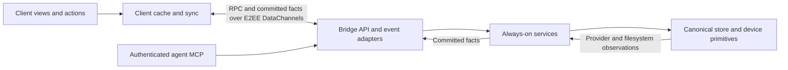

# Bridge and client architecture plan

**Status:** proposed implementation plan for #86, 2026-09-23. Documentation only.
**Source baseline:** `6a219d987b88cbab5f866dd9e3e0a8fbf31ba9ad` (`origin/main` when this branch was cut).

Move as much product logic as can run reliably in the client into the client. Keep work that needs a persistent process in the bridge, in services isolated from RPC and event delivery. This is Zech's clarification on #86; it supersedes the original audit's suggestions to extract autonomous policy into a browser or separately distributed policy runtime. No additional controller process is proposed.

The recommended client is **TypeScript, adopted incrementally, with the existing framework-free DOM and ES-module design**. The architecture work can start in JavaScript; it does not depend on converting the entire SPA. Read the [language decision](client-language.md) for the alternatives, evidence and cost.

## Where everything runs

| Component | Location | Owns |
| --- | --- | --- |
| SPA | Browser, including the page loaded by the Electron desktop shell | Cache-backed views, grouping, formatting, navigation, user-selected defaults, optimistic display and composition of interactive commands. |
| RPC/MCP adapters and event delivery | Device bridge | Versioned input/output contracts, caller authentication, capability negotiation, subscriptions, bounded encoding and transport. No workflow decisions. |
| Always-on application services | Same bridge process | Agent delivery/recovery, capture routing, prompts and agent tool behavior, assignment side effects, automatic tracker transitions, compaction, usage-limit retries and notification decisions. They run without a client. |
| Canonical storage and device primitives | Device bridge | Records, read marks, receipts, transaction boundaries, filesystem/git, PTYs, harness adapters, credentials and final safety checks. |
| Skrift application server | Hosted service | Login/accounts, approved device registry, static SPA distribution, presence and content-free web push. It does not become a plaintext workspace controller. |
| Relay and TURN | Network infrastructure | Relay authenticates/rendezvous/signals; application RPC/events use E2EE WebRTC DataChannels over direct or TURN paths. |
| Agent clients | Local harness/MCP connections | Invoke the same service commands as user clients within their authenticated scopes. They do not need an open SPA. |

The [desktop shell](../../desktop/src/security-policy.mjs) loads the hosted application. It does not acquire a separate business-logic copy or become the only place background work runs. Another future client consumes the same contracts and implements its own presentation.

## Ownership rules

1. If it only decides what a person sees or how an interactive action is assembled, prefer the client. Examples: dashboard groups, browser-facing notice copy, file order, model-picker labels and forms. Agent-facing thread notices and prompt text remain always-on service policy.
2. If correctness or progress depends on running after every client closes, keep it in a bridge service. The RPC handler must not implement it, and the event publisher must not trigger it.
3. If it authorizes a mutation, arbitrates concurrent writers, touches the device or proves historical completeness, enforce it on the bridge. A client may duplicate a check for feedback, never replace it.
4. Every cached entity follows #82: pull/event -> cache commit -> address notification -> reread -> view. A command response is not a second render source. Cache absence, authoritative empty data and stale/partial data are distinct.
5. Keep bounded server queries and local computation where transferring all underlying data would be worse. A git graph walk, exact unread count or cursor order is a data primitive; dashboard ranking is client policy.

## Read the plans by area

| Plan | Purpose | Original audit items |
| --- | --- | --- |
| [Client projections](migrations/01-client-projections.md) | Move reader-facing derivation, copy and grouping; retain factual counts and safety checks. | 1–9, 25; presentation half of 10 and 24 |
| [Contracts and cache](migrations/02-contracts-and-cache.md) | Versioned facts, operation receipts, reconnect coverage, cache ownership and #85 paging. | Cross-cutting prerequisites from sections 2, 3 and 5 |
| [Interactive commands and defaults](migrations/03-client-commands.md) | Move client choices without splitting accepted durable operations across browser lifetime. | 10–15; interactive half of 16 |
| [Always-on services](migrations/04-always-on-services.md) | Reclassify autonomous logic as bridge service work, not a client migration. | 8, 10–11, 15–26 where persistent or authoritative |
| [Bridge structure](bridge-structure.md) | Modules, allowed dependencies, interfaces and execution flow. | Target structure |
| [Client structure](client-structure.md) | Modules, cache/state boundaries, selectors and actions. | Target structure |
| [Client language](client-language.md) | JavaScript vs TypeScript vs Rust/Go WASM; migration and cost. | Technology decision |

## Rough delivery order

| Phase | Work / exit | Release required when implemented |
| --- | --- | --- |
| P0 | Record current behavior, contract fixtures and ownership; add incremental type-check/lint support for the first typed slice. | App only for tooling; no runtime release for this documentation. |
| P1 | Move projections and explicit form defaults using existing facts and methods. Existing dashboard/cache improvements are inputs, not work to redo. | App only. |
| P2 | Add missing factual queries, revision/operation semantics, snapshot coverage and paging. New clients retain old-bridge adapters. | Bridge + app for additive contracts; gate client use by capability. |
| P3 | Extract always-on services behind typed facades, one workflow at a time; route RPC, MCP and provider observations through them. Finish client command composition over those facades. | Bridge for internal extraction; bridge + app where an interface changes. |
| P4 | Remove unused presentation projections and retired implementations after consumer/data review. Preserve historical reads and old API behavior until their explicit retirement. | Bridge; breaking wire removals need a major or separately negotiated contract. |

P1 need not wait for every P0 type conversion; P3 service extraction can proceed independently of P2 additions when preserving the current wire. Do not combine language conversion, directory moves, changed workflow semantics and new protocol behavior in one patch. A bridge roll remains necessary for changes to always-on behavior; the goal is to avoid requiring it for client-safe product changes.

## Scope and validation

These plans supersede the ownership recommendations in the September 22 audit, not every older specification. [v2's roadmap](../v2/roadmap.md) contains historical sections; use its amendments and the binding [Strict P2P Transport Spec](../v2/Strict%20P2P%20Transport%20Spec.md), [wire spec](../v2/Bridge%20Wire%20Protocol%20Spec.md), [modularization strategy](../v2/Bridge%20Modularization%20Strategy.md), [concurrency spec](../v2/Bridge%20Concurrency%20Spec.md) and [workspaces plan](../v2/workspaces.md) as constraints. This directory adds the cross-component ownership plan rather than renumbering the existing v2 specifications.

The singular `issue.*`/`plan.*` mutating workflow is [retired](../../bridge/src/app/rpc.rs#L342); plural `issues.*` is the active tracker. Do not revive the old stage scheduler. The separately filed branchFinish deletion/completion mismatch is a compatibility dependency, not new work duplicated here.

For each implementation slice: preserve applicable complexity gates, run the affected suite and integration fixtures, and prove the behavior at its boundary. Required scenarios are cache-first mount with absent payload, real cache-write-to-redraw, old/new clients, two clients racing, browser-closed agent work, lost ACK, restart during delivery, and partial/paged history. Use profile evidence before moving expensive computation or adding WASM. This branch changes only planning documents; it performs no application or bridge roll.
